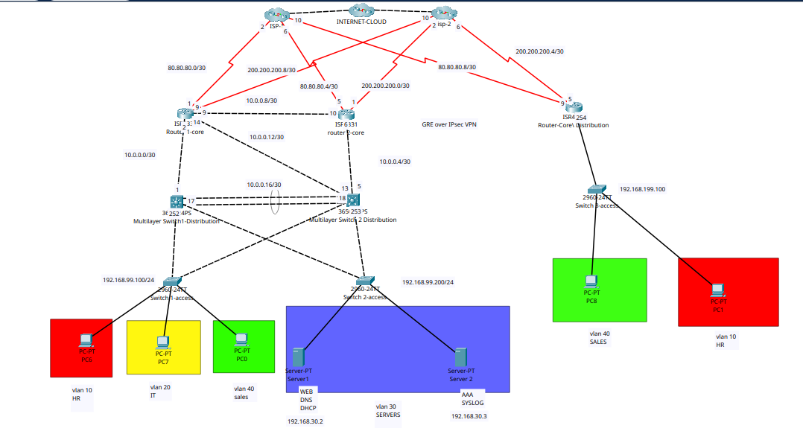

# Enterprise Network Design & Implementation (Cisco Stack)

## 📋 Project Overview
This project demonstrates a high-availability enterprise network design, featuring redundant routing, multi-site connectivity, and advanced Layer 2 security.

## 🗺️ Topology

## 🛠️ Technical Documentation

## 🌐 Network Infrastructure & Connectivity (L3/WAN)

| Device | Interface | IP Address | Role / Description |
| :--- | :--- | :--- | :--- |
| **HQ-ROUTER-1** | G0/0/0 | 10.0.0.2/30 | Link to HQ-SW1-L3 |
| **HQ-ROUTER-1** | G0/0/1 | 10.0.0.9/30 | Link to HQ-ROUTER-2 |
| **HQ-ROUTER-1** | G0/0/2 | 10.0.0.14/30 | Link to HQ-SW2-L3 |
| **HQ-ROUTER-1** | Se0/1/1 | 80.80.80.1/30 | Link to ISP-1 |
| **HQ-ROUTER-1** | Se0/1/0 | 200.200.200.9/30 | Link to ISP-2 |
| **HQ-ROUTER-2** | G0/0/0 | 10.0.0.6/30 | Link to HQ-SW2-L3 |
| **HQ-ROUTER-2** | G0/0/1 | 10.0.0.10/30 | Link to HQ-ROUTER-1 |
| **HQ-ROUTER-2** | Se0/1/0 | 80.80.80.5/30 | Link to ISP-1 |
| **HQ-ROUTER-2** | Se0/1/1 | 200.200.200.1/30 | Link to ISP-2 |
| **HQ-ROUTER-2** | Tunnel0 | 172.16.0.1/30 | VPN Link to Branch-Router |
| **BRANCH-ROUTER** | Se0/1/0 | 200.200.200.5/30 | Link to ISP-2 |
| **BRANCH-ROUTER** | Se0/1/1 | 80.80.80.9/30 | Link to ISP-1 |
| **BRANCH-ROUTER** | Tunnel0 | 172.16.0.2/30 | VPN Link to HQ-Router-2 |

## 🏢 LAN Configuration & Gateway Redundancy (HSRP)

| Device | Interface/VLAN | IP Address | Role / Description | Status |
| :--- | :--- | :--- | :--- | :--- |
| **HQ-SW1-L3** | VLAN 10 (SVI) | 192.168.10.252 | Gateway for HR | **ACTIVE** |
| **HQ-SW1-L3** | VLAN 20 (SVI) | 192.168.20.252 | Gateway for IT | **ACTIVE** |
| **HQ-SW1-L3** | VLAN 30 (SVI) | 192.168.30.252 | Gateway for SERVERS | STANDBY |
| **HQ-SW1-L3** | VLAN 40 (SVI) | 192.168.40.252 | Gateway for SALES | STANDBY |
| **HQ-SW1-L3** | VLAN 99 (SVI) | 192.168.99.252 | Gateway for MANAGEMENT | **ACTIVE** |
| **HQ-SW2-L3** | VLAN 10 (SVI) | 192.168.10.253 | Gateway for HR | STANDBY |
| **HQ-SW2-L3** | VLAN 20 (SVI) | 192.168.20.253 | Gateway for IT | STANDBY |
| **HQ-SW2-L3** | VLAN 30 (SVI) | 192.168.30.253 | Gateway for SERVERS | **ACTIVE** |
| **HQ-SW2-L3** | VLAN 40 (SVI) | 192.168.40.253 | Gateway for SALES | **ACTIVE** |
| **HQ-SW2-L3** | VLAN 99 (SVI) | 192.168.99.253 | Gateway for MANAGEMENT | STANDBY |
| **BRANCH-ROUTER** | G0/0/0.10 | 192.168.110.254 | Gateway for HR | N/A |
| **BRANCH-ROUTER** | G0/0/0.20 | 192.168.120.254 | Gateway for IT | N/A |
| **BRANCH-ROUTER** | G0/0/0.40 | 192.168.140.254 | Gateway for SALES | N/A |
| **BRANCH-ROUTER** | G0/0/0.99 | 192.168.199.254 | Gateway for MANAGEMENT | N/A |

## 🛠 Management, Loopbacks & Service Endpoints

| Device | Interface | IP Address | Role / Description |
| :--- | :--- | :--- | :--- |
| **HQ-ROUTER-1** | Loopback0 | 1.1.1.1/32 | Router-ID / Management |
| **HQ-ROUTER-2** | Loopback0 | 2.2.2.2/32 | Router-ID / Management |
| **BRANCH-ROUTER** | Loopback0 | 3.3.3.3/32 | Router-ID / Management |
| **HQ-SW1-L3** | Loopback0 | 4.4.4.4/32 | Router-ID / Management |
| **HQ-SW2-L3** | Loopback0 | 5.5.5.5/32 | Router-ID / Management |
| **HQ-SW1-L2** | VLAN 99 (SVI) | 192.168.99.100/24 | MANAGEMENT |
| **HQ-SW2-L2** | VLAN 99 (SVI) | 192.168.99.200/24 | MANAGEMENT |
| **BRANCH-SW** | VLAN 99 (SVI) | 192.168.199.100/24 | MANAGEMENT |
| **SERVER-1** | G0/1 | 192.168.30.2/24 | WEB, DNS, DHCP |
| **SERVER-2** | G0/2 | 192.168.30.3/24 | AAA, SYSLOG |
---

## 🔍 Troubleshooting & Engineering Challenges
See the full log here: [Troubleshooting Log](./Troubleshooting_Log/troubleshooting_log)

### Highlights:
* **NAT Mapping Persistence:** Identified simulation-specific constraints in Packet Tracer regarding multi-interface NAT bindings.
* **L2 Security & EtherChannel Conflict:** Strategically redesigned the Access Layer to ensure 100% stability of DHCP Snooping and DAI.

---
## 🚀 Deployment Files
* [Device Configurations](./Configs/)
* [Verification Screenshots](./Verification/)

## 🚀 Future Goals: EVE-NG Migration
The next phase involves migrating this architecture to EVE-NG to validate advanced IOS features and confirm simulation-specific behaviors identified during this build.
